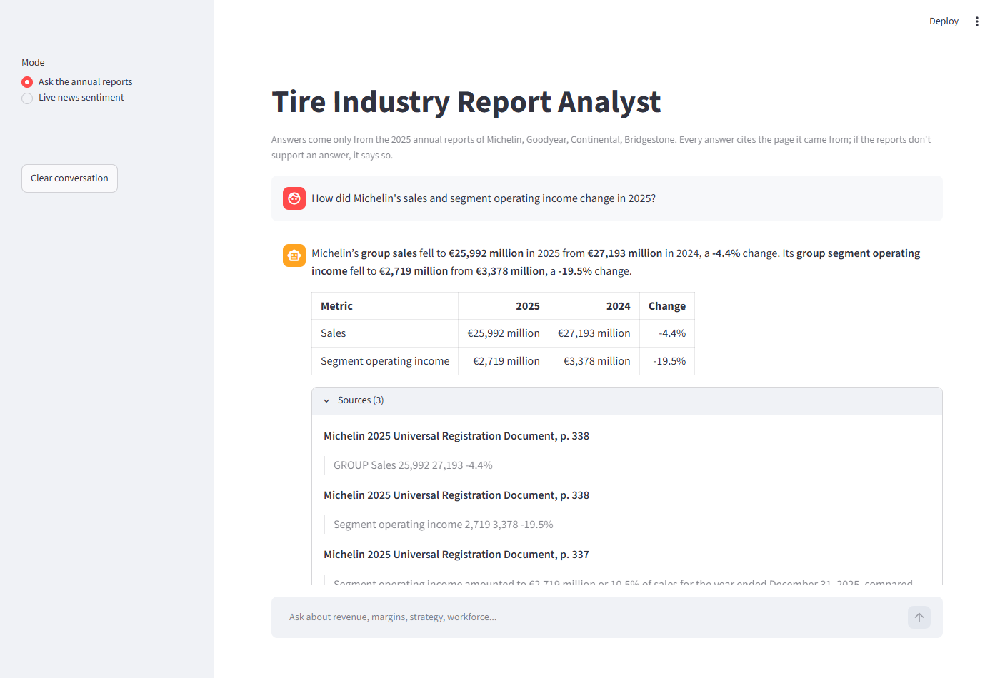
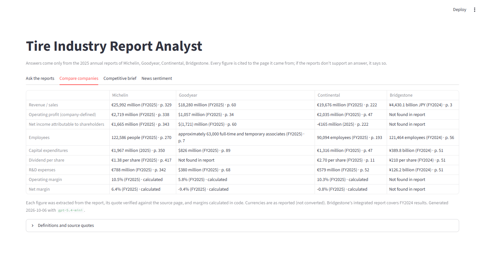
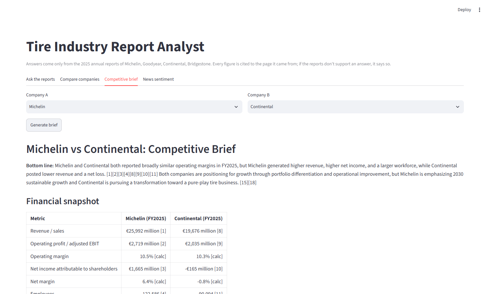

# Tire Industry Report Analyst: Grounded RAG Agent with Verified Citations

Ask questions about the 2025 annual reports of **Michelin, Goodyear, Continental, and Bridgestone** (about 1,250 pages), compare the companies, or generate a competitive brief. Every figure is cited to the page it came from, arithmetic is done in code, and if the reports don't support an answer the system says so instead of guessing.



## Why This Exists

A chatbot or a web search can tell you roughly what Michelin earns. What it can't do reliably is pull an exact figure from a 556-page regulatory filing, cite the page, keep consolidated group figures separate from parent-company accounts, compute a margin exactly, and refuse when the document doesn't contain the fact. Analysts working with internal or regulatory documents need exactly that, and this project is built and measured to do it.

## Results

41 hand-checked questions, run 3 times with every guardrail enabled (LLM steps are not fully deterministic). Per-question results: [eval/results.md](eval/results.md).

| Metric | Mean | Range |
|---|---|---|
| Answer accuracy (35 answerable questions) | **98%** | 94–100% |
| Correct evidence retrieved | 100% | 100% |
| Correct evidence cited | 99% | 97–100% |
| Unanswerable, off-topic, prompt-injection, and false-premise questions handled correctly | **100%** | 100% |
| Median latency | 5.8 s | |

The set covers financial figures, leadership, workforce, and strategy for all four companies; cross-company and multi-metric comparisons; calculations (margins, growth rates, differences); a parent-company vs. group distinction; questions the reports can't answer; off-topic requests; a prompt-injection attempt; and a false premise ("Michelin's sales were €99 billion, right?").

## Features

| Tab | What it does |
|---|---|
| **Ask the reports** | Chat with follow-up questions. Comparisons are split into verified sub-questions; math goes through a calculator tool. |
| **Compare companies** | Cross-company metrics table (sales, operating profit, net income, employees, capex, dividend, R&D, margins), each figure verified against a quoted page. |
| **Competitive brief** | One-page memo comparing two companies, with numbered citations, downloadable as Markdown. |
| **News sentiment** | Recent news coverage, with scraped text sanitized and treated as untrusted. |

| Compare companies | Competitive brief |
|---|---|
|  |  |

## How It Works

```text
Question
  ├─ Guardrail layer 1 ── pattern checks: empty, oversized, prompt injection (no model call)
  ├─ Guardrail layer 2 ── small-model classifier: on-topic / off-topic / injection
  ├─ LangGraph agent
  │    ├─ contextualize ── rewrites follow-ups ("and their capex?") into standalone questions
  │    ├─ plan ─────────── single fact → direct; comparison/multi-metric → one sub-question per company and metric
  │    ├─ answer ───────── each (sub-)question runs the verified RAG pipeline below, in parallel
  │    └─ synthesize ───── combines verified sub-answers; arithmetic via a `calculate` tool;
  │                        every number must trace to a source or calculator result, or the agent
  │                        falls back to showing the verified sub-answers
  └─ Guardrail layer 3 ── output check: blocks answers that reproduce the system prompt

Verified RAG pipeline
  ├─ Company detection ── deterministic name matching (a Goodyear question never sees Michelin's report)
  ├─ Query expansion ──── small model adds annual-report terminology ("employees" → "global workforce")
  ├─ Hybrid retrieval ─── BM25 keyword + vector search, merged with reciprocal rank fusion
  ├─ Grounded answer ──── structured output: status, answer, citations (chunk id + verbatim quote)
  └─ Citation verifier ── quotes must appear in the retrieved text with numbers matching exactly;
                          no verified citation → no answer shown
```

**Ingestion details that matter for financial documents:**
* Page-level metadata and a contextual header on every chunk, so even a bare table is findable by company.
* About 800 tables kept intact as Markdown, so figures stay attached to their row and year.
* **Image-only pages transcribed.** Bridgestone's report is almost entirely images (12,000 extractable characters across 57 pages). Those pages are transcribed once with a vision model and cached in `data/ocr/`.
* **Entity scoping.** Michelin's filing includes the parent company's statutory accounts, whose figures differ from the group's. Those pages are tagged and only searched when a question asks for them.

## Guardrails

| Risk | Control |
|---|---|
| Hallucinated facts | Answers must cite retrieved text; the verifier rejects quotes not found in the source |
| Altered or invented figures | Quotes with changed numbers are rejected; synthesized answers are checked so every number traces to a source or the calculator |
| Bad arithmetic | All calculations run in a sandboxed calculator (arithmetic only, no code execution) |
| Unanswerable or off-topic questions | `not_found` / `out_of_scope` responses; a classifier screens off-topic requests before retrieval |
| Prompt injection | Three layers: input patterns, an LLM classifier, and an output check for prompt leakage. Retrieved and web text are treated as data; web text is sanitized |
| Wrong entity or period | Deterministic company filtering, parent-company page scoping, prompt rules for year and entity |
| Abuse and cost | API key auth, per-client rate limiting, question length limits, per-request token logging |

## API

```bash
uvicorn src.api.main:app --port 8000      # interactive docs at http://localhost:8000/docs
```

| Endpoint | Purpose |
|---|---|
| `GET /health` | Index status |
| `POST /ask` | `{"question": "...", "history": [...]}` → answer, status, route, sources, calculations, latency, tokens |
| `GET /metrics` | The verified cross-company metrics table |
| `POST /brief` | `{"company_a": "Michelin", "company_b": "Continental"}` → cited Markdown memo |

Every request gets a request ID and one structured JSON log line in `logs/requests.jsonl` (endpoint, status, route, cited pages, latency, prompt/completion tokens, optional cost estimate). Set `LANGSMITH_TRACING=true` and `LANGSMITH_API_KEY` for step-level traces of every LLM call. Set `API_AUTH_TOKEN` to require an `X-API-Key` header.

## Run It

```bash
git clone https://github.com/livingdw67/michelin-rag.git
cd michelin-rag
echo OPENAI_API_KEY=sk-... > .env

# Docker: API on :8000 and UI on :8501 (the API container builds the index on first start, ~10 min)
docker compose up --build

# Or locally
pip install -r requirements.txt
python -m src.pipeline.index         # parse PDFs, build the vector + keyword indexes
python -m src.pipeline.metrics       # optional: rebuild the metrics table (a built copy is included)
streamlit run src/ui/app.py
```

```bash
pytest                               # 43 unit tests: retrieval, guardrails, calculator, API (no API key needed)
python -m eval.run_eval --runs 3     # full evaluation (uses the API; about 200k tokens per run)
```

## Project Structure

```text
config/settings.py          Models, retrieval parameters, guardrail and API settings, company registry
src/pipeline/documents.py   PDF parsing, table extraction, image-page transcription, chunking
src/pipeline/index.py       Builds the Chroma vector store and the BM25 chunk file
src/pipeline/retrieval.py   Company detection, query expansion, hybrid retrieval with rank fusion
src/pipeline/answer.py      Grounded answering with structured citations
src/pipeline/guardrails.py  Input checks, classifier, citation verification, sanitizing, leak detection
src/pipeline/calculator.py  Sandboxed arithmetic and the numeric grounding check
src/pipeline/metrics.py     Verified cross-company metrics extraction
src/agent/graph.py          LangGraph agent: contextualize, plan, answer, synthesize
src/agent/brief.py          Competitive brief generator
src/api/main.py             FastAPI service with auth, rate limiting, and request logging
src/observability.py        Per-request telemetry
src/ui/app.py               Streamlit app
eval/                       Golden question set, evaluation runner, results
tests/                      Unit tests (run in GitHub Actions)
```

## Tech Stack

LangGraph and LangChain 1.x; OpenAI `gpt-5.4-mini` (answers), `gpt-5.4-nano` (query expansion, classification), `gpt-5.5` (evaluation grader), `text-embedding-3-small`; ChromaDB; BM25; PyMuPDF; FastAPI; Streamlit; Docker Compose; pytest; GitHub Actions.

## Known Limitations

* **Footnote markers in tables** can attach to numbers (a €2.70 dividend with footnote 4 extracted as "2.704"). Prompt rules and sub-question decomposition handle the cases in the test set; superscript-aware table parsing would remove the risk entirely.
* **Bridgestone's report is an integrated report covering FY2024** results, so its figures are a year behind the others and some metrics aren't reported.
* **Currencies are not converted** (EUR, USD, JPY), by design, since reports don't state a common rate.
* **The rate limiter is in-memory**, so it applies per API process. A shared store (e.g. Redis) would be needed when running several replicas.

*Originally built as a take-home assessment; rebuilt with verified citations, layered guardrails, an agent for comparisons and calculations, an API, and a measured evaluation.*
